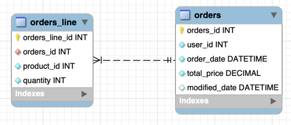

# whatap-orders

와탭랩스 백엔드 개발자 채용 과제 프로젝트 orders server입니다.

---

목차

1. [기술 요구 사항](#기술-요구-사항)
2. [기능 요구 사항](#기능-요구-사항)
3. [디렉토리 구조](#디렉토리-구조)
4. [데이터베이스 스키마](#데이터베이스-스키마)
5. [API 명세](#api-명세)

---

## 기술 요구 사항

언어: Java 17 <br>
프레임워크: Quarkus 3.8.1 <br>
데이터베이스: PostgreSQL <br>
ORM: panache <br>
port: 8081

---

## 기능 요구 사항

1. 주문 조회
2. 주문 목록 조회
3. 주문 생성
4. 주문 변경
5. 주문 삭제
6. 데이터베이스 지연

---

## 디렉토리 구조

```
java
+--adapter
| +--ProductAdapter.java
|
+--controller
| +--OrdersController.java
| |
| +--UtilityController.java
|
+--dto
| +--req
| | +--OrdersLineRequestDto.java
| | |
| | +--OrdersRequestDto.java
| | |
| | +--OrdersUpdateRequestDto.java
| |
| +--res
| +--OrdersResponseDto.java
| |
| +--ProductResponseDto.java
|
+--entity
| +--Orders.java
| |
| +--OrdersLine.java
|
+--exception
| +--CustomException.java
| |
| +--CustomExceptionHandler.java
| |
| +--OrdersNotFoundException.java
| |
| +--ProductNotFoundException.java
| |
| +--SleepQueryException.java
|
+--repository
| +--OrdersLineRepository.java
| |
| +--OrdersRepository.java
|
+--service
  +--OrdersLineService.java
  |
  +--OrdersService.java
  |
  +--ProductService.java
  |
  +--UtilityService.java
```

---

## 데이터베이스 스키마



---

## API 명세

| API          | API URL                    | Method | Request                                                                                                                                             | Response                                                                                                                                                                                                                                                                                                      | StatusCode |
|--------------|----------------------------|--------|-----------------------------------------------------------------------------------------------------------------------------------------------------|---------------------------------------------------------------------------------------------------------------------------------------------------------------------------------------------------------------------------------------------------------------------------------------------------------------|------------|
| orderProduct | /orders/add                | POST   | {<br> "userId" : 0,<br> "ordersLineRequestDto" : [<br> {<br>   "ordersLineId" int,<br> "productId": int,<br>   "quantity" : int<br>    }<br> ]<br>} | Integer                                                                                                                                                                                                                                                                                                       | 201        |
| getOrder     | /orders/get/{orders_id}    | GET    |                                                                                                                                                     | {<br>  "orderId" : int,<br> "userId" : int,<br> "orderDate" : DATETIME,<br> "modifiedDate" : DATETIME,<br> "totalPrice" : Double,<br> "ordersLineInfos" : [<br> {<br> "ordersLineId" : int,<br> "productId" : int,<br> "productName" : "string",<br> "quantity" : int,<br> "subTotal" : Double<br>}<br>]<br>} | 200        |
| getOrders    | /orders/get                | GET    |                                                                                                                                                     | {<br>  "orderId" : int,<br> "userId" : int,<br> "orderDate" : DATETIME,<br> "modifiedDate" : DATETIME,<br> "totalPrice" : Double,<br> "ordersLineInfos" : [<br> {<br> "ordersLineId" : int,<br> "productId" : int,<br> "productName" : "string",<br> "quantity" : int,<br> "subTotal" : Double<br>}<br>]<br>} | 200        |
| changeOrder  | /orders/update             | PUT    | {<br> "ordersId" : int,<br> "ordersLineRequestDto" : [<br>{<br> "ordersLineId" : int,<br>"productId" : int,<br> "quantity" : int,<br>}<br>]<br>}    | Intger                                                                                                                                                                                                                                                                                                        | 201        |
| deleteOrder  | /orders/delete/{orders_id} | DELETE |                                                                                                                                                     |                                                                                                                                                                                                                                                                                                               | 204        |
| sleep        | /utility/sleep/{time}      | GET    |                                                                                                                                                     | "string"                                                                                                                                                                                                                                                                                                      | 200        |

